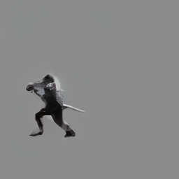
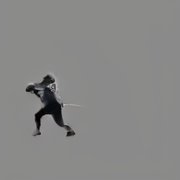
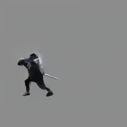
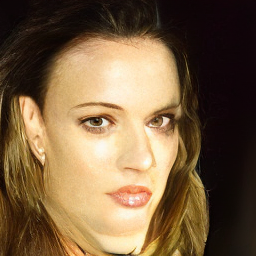

# diffusion_from_scratch
Implementing diffusion models from scratch, with easy-to-read/use/customize code.

## Install
* Python 3.12
* Pytorch 2.4.1

## Features

## video generation results
* `unet_small` vs. `unet_medium` vs. `unet_large` vs. `unet_small (spatial only)`

 vs.  vs.  vs. 

## text-to-image generation results
* This person has brown hair.

