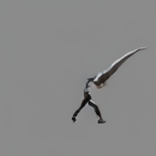

# diffusion_from_scratch
Implementing diffusion models from scratch, with easy-to-read/use/customize code.

## Features

## video generation results
* `unet_small` vs. `unet_medium` vs. `unet_large`

 vs.  vs. 

* `unet_small`: `spatial only` vs. `spatial + temporal`

 vs. 

