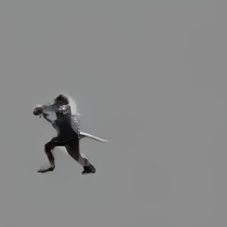
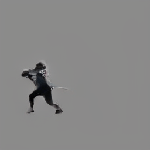
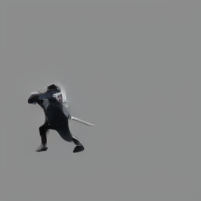
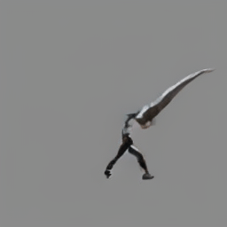
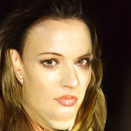

# diffusion_from_scratch
Implementing diffusion models from scratch, with easy-to-read/use/customize code.


## Install
* Python 3.12
* Pytorch 2.4.1


## Features
* spatial-temporal resnet and transformer
* text-to-image/video
* multi-gpu training
* mixed precision training
* iadb / rectified flow


## How to use
* Training loop
```
for iter in range(iters):
    noise = diffusionmodel.sample_noise(data)
    t = diffusionmodel.sample_timesteps(device, data.shape[0])
    x_t = diffusionmodel.add_noise(data, t, noise)
    pred = diffusionmodel.neuralnet(x_t, t, text_embeddings)
    loss = diffusionmodel.loss(pred, data, noise)
    optimizer.zero_grad()
    accelerator.backward(loss)
    accelerator.clip_grad_norm_(diffusionmodel.neuralnet.parameters(), 1.0)
    optimizer.step()
```
* Inference loop
```
out = diffusionmodel.sample(diffusionmodel.neuralnet, initial_noise, text_embeddings)
decoded_latents = vae.decode(out.half() / diffusionmodel.scaled_vae_latent_factor).sample
```


## video generation results
* `unet_small` vs. `unet_medium` vs. `unet_large` vs. `unet_small (spatial only)`

 vs.  vs.  vs. 


## text-to-image generation results
* This person has brown hair.



